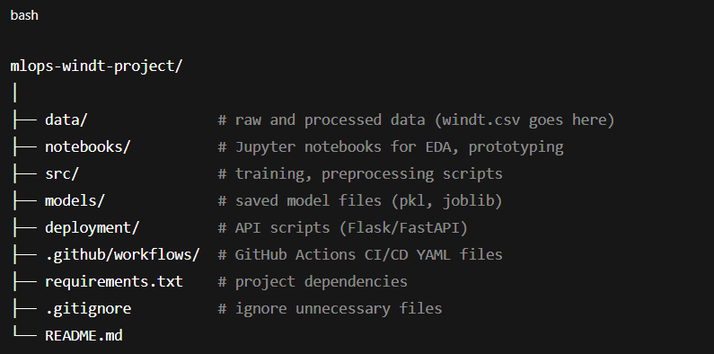

# mlops-windt-project

This project demonstrates an end-to-end MLOps lifecycle using GitHub, CI/CD (GitHub Actions), MLflow, and DVC. The workflow automates model training, versioning, and deployment using a real-world dataset (`windt.csv`).

---

## 🚀 Project Setup Instructions

### ✅ Step 1: Create GitHub Repository

- Go to [GitHub](https://github.com)
- Click **New Repository**
- Fill in:
  - **Repository name**: `mlops-windt-project`
  - **Description**: MLOps Lifecycle Implementation with CI/CD using GitHub on windt.csv dataset
  - ✅ Public or Private (your choice)
  - ✅ Initialize with `README.md`
- Click **Create repository**

---

### ✅ Step 2: Clone the Repository

```bash
git clone https://github.com/your-username/mlops-windt-project.git
cd mlops-windt-project
```

### ✅ Step 3: Create Folder Structure
mkdir data notebooks src models deployment .github
mkdir .github/workflows
touch requirements.txt .gitignore

### ✅ Step 4: Add Dataset
mv /path/to/windt.csv data/

### ✅ Step 5: Initial Commit
git add .
git commit -m "Initial project structure and dataset added"
git push origin main



### To create new environment
```bash
python -m venv windt_pro
```

### To activate the environment
```bash
windt_pro\Scripts\activate
```
