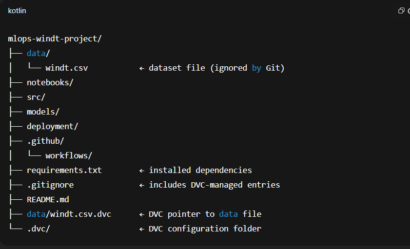

# mlops-windt-project

This project demonstrates an end-to-end MLOps lifecycle using GitHub, CI/CD (GitHub Actions), MLflow, and DVC. The workflow automates model training, versioning, and deployment using a real-world dataset (`windt.csv`).

---

## 🚀 Project Setup Instructions

### ✅ Step 1: Create GitHub Repository

- Go to [GitHub](https://github.com)
- Click **New Repository**
- Fill in:
  - **Repository name**: `mlops-windt-project`
  - **Description**: MLOps Lifecycle Implementation with CI/CD using GitHub on windt.csv dataset
  - ✅ Public or Private (your choice)
  - ✅ Initialize with `README.md`
- Click **Create repository**

---

### ✅ Step 2: Clone the Repository

```bash
git clone https://github.com/your-username/mlops-windt-project.git
cd mlops-windt-project
```

### ✅ Step 3: Create Folder Structure
mkdir data notebooks src models deployment .github
mkdir .github/workflows
touch requirements.txt .gitignore

### ✅ Step 4: Add Dataset
mv /path/to/windt.csv data/

### ✅ Step 5: Initial Commit
git add .
git commit -m "Initial project structure and dataset added"
git push origin main


### To create new environment
```bash
python -m venv windt_pro
```

### To activate the environment
```bash
windt_pro\Scripts\activate
```


### ✅ Step 6: Install Required Libraries

```bash
pip install pandas scikit-learn mlflow dvc matplotlib
```

``` bash
pip install fastapi uvicorn
```
### Save the Environment
```bash
pip freeze > requirements.txt
```

### ✅ Step 7: Initialize MLflow and DVC

#### Initialize DVC for Data Tracking

 ``` bash
dvc init
```
### Track your dataset
``` bash
dvc add data/windt.csv
```


### Commit DVC Metadata

``` bash
git add .gitignore data/windt.csv.dvc .dvc/
git commit -m "Initialize DVC and track dataset"
git push origin main
```


📁 Folder Structure (After DVC Initialization)




### ✅ Step 8: Create the Training Script (train.py)
This script will:

Load the dataset (windt.csv)

Train a basic model (e.g., Linear Regression)

Log parameters, metrics, and model using MLflow


Create a new file:
src/train.py

``` bash 

import pandas as pd
import numpy as np
from sklearn.model_selection import train_test_split
from sklearn.linear_model import LinearRegression
from sklearn.metrics import mean_squared_error, r2_score
import mlflow
import mlflow.sklearn
from math import sqrt

# Start MLflow experiment
mlflow.set_experiment("Wind Speed Prediction")

with mlflow.start_run():
    # Load dataset
    df = pd.read_csv("data/windt.csv")

    # Basic preprocessing: drop NA values
    df = df.dropna()

    # Define features and target column (update target column name if needed)
    X = df.drop("TurbineName", axis=1)  # ← Replace with actual target column if different
    y = df["TurbineName"]

    # Split into training and testing sets
    X_train, X_test, y_train, y_test = train_test_split(
        X, y, test_size=0.2, random_state=42
    )

    # Train a simple Linear Regression model
    model = LinearRegression()
    model.fit(X_train, y_train)

    # Predict and evaluate
    y_pred = model.predict(X_test)
    rmse = sqrt(mean_squared_error(y_test, y_pred))
    r2 = r2_score(y_test, y_pred)

    # Log parameters and metrics
    mlflow.log_param("model_type", "LinearRegression")
    mlflow.log_metric("rmse", rmse)
    mlflow.log_metric("r2_score", r2)

    # Log the model with input example
    example_input = X_test.iloc[:1]
    mlflow.sklearn.log_model(
        sk_model=model,
        artifact_path="linear_regression_model",
        input_example=example_input
    )

    # Print evaluation results
    print(f"RMSE: {rmse:.4f}")
    print(f"R2 Score: {r2:.4f}")


```

### Run the Training Script
``` bash
python src/train.py
```

### ✅ Step 9: Launch MLflow Tracking UI

▶️ Run this in your terminal 

``` bash
mlflow ui
```

By default, MLflow runs at:
http://127.0.0.1:5000


### ✅ Step 10: Set Up CI/CD with GitHub Actions

Our goal here is to automate the training pipeline (i.e., run train.py) whenever someone pushes code to the GitHub repo — using GitHub Actions.

i. In the Explorer sidebar:

* Right-click the .github folder → Click "New Folder" → name it workflows (if it doesn't exist).

* Right-click the workflows folder → Click "New File" → name it train.yml.

ii. Paste the following workflow YAML into train.yml:

``` bash
name: Train Model on Push

on:
  push:
    branches:
      - main

jobs:
  train-model:
    runs-on: ubuntu-latest

    steps:
    - name: Checkout repo
      uses: actions/checkout@v3

    - name: Set up Python
      uses: actions/setup-python@v4
      with:
        python-version: '3.10'

    - name: Install dependencies
      run: |
        python -m pip install --upgrade pip
        pip install -r requirements.txt

    - name: Run training script
      run: |
        python src/train.py


```

After saving the file, commit and push it:

``` bash
git add .github/workflows/train.yml
git commit -m "Add GitHub Actions training workflow"
git push origin main
```